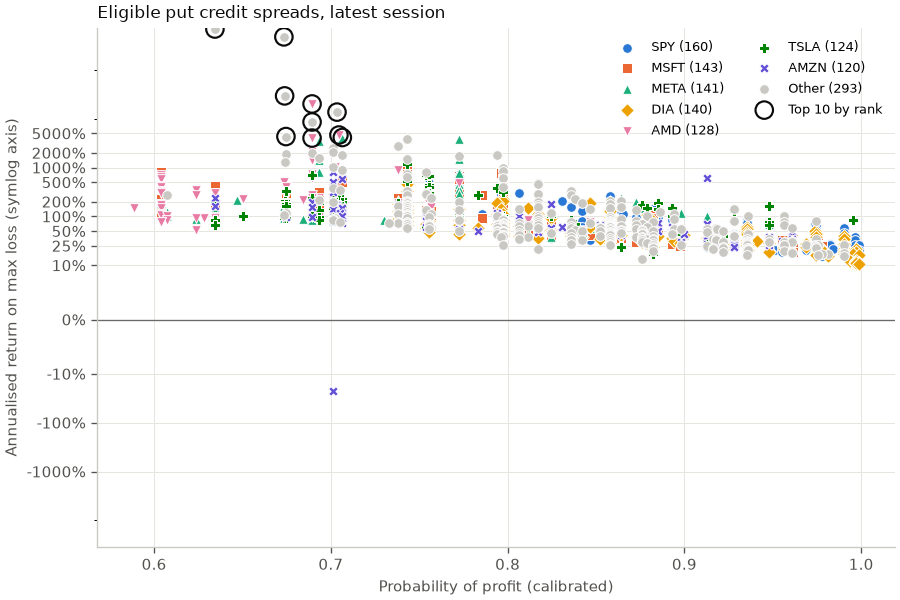

# Results

Source: the `gold` schema of the DuckDB file built by dbt; spreads are scored as of the 2026-11-17 session.

## Data coverage

| Underlying | First session | Last session | Sessions | Chain snapshots | Settled snapshots | Predictions |
| --- | ---: | ---: | ---: | ---: | ---: | ---: |
| AAPL | 2020-01-06 | 2026-11-17 | 1,223 | 3,877 | 3,774 | 47,791 |
| AMD | 2020-01-06 | 2026-11-17 | 1,220 | 3,871 | 3,767 | 47,799 |
| AMZN | 2020-01-06 | 2026-11-17 | 1,219 | 3,866 | 3,764 | 47,498 |
| DIA | 2020-01-06 | 2026-11-17 | 1,221 | 3,885 | 3,763 | 47,223 |
| GOOGL | 2020-01-06 | 2026-11-17 | 1,214 | 3,852 | 3,750 | 47,361 |
| META | 2022-07-01 | 2026-11-17 | 854 | 2,770 | 2,667 | 33,585 |
| MSFT | 2020-01-06 | 2026-11-17 | 1,209 | 3,831 | 3,729 | 47,067 |
| NVDA | 2020-01-06 | 2026-11-17 | 1,218 | 3,854 | 3,754 | 46,945 |
| SPY | 2020-01-06 | 2026-11-17 | 1,211 | 3,881 | 3,771 | 46,801 |
| TSLA | 2021-01-04 | 2026-11-17 | 1,069 | 3,409 | 3,306 | 41,798 |
| XLF | 2020-01-06 | 2026-11-17 | 1,211 | 3,854 | 3,748 | 47,432 |

In total: 1,877,260 quotes on 537,640 contracts, in 40,950 chain snapshots (an underlying, a trade date and an expiration).

## Snapshot exclusions

Every chain snapshot is classified; only `ok` snapshots produce predictions. Snapshot exclusions are counted here. Row-level filters (crossed quotes, inconsistent OHLC bars, staging filters) are logged by the loaders and are not counted in this report.

| Status | Snapshots | Share | Meaning |
| --- | ---: | ---: | --- |
| `ok` | 39,558 | 96.6% | enters the calibration sample |
| `unsettled` | 1,157 | 2.8% | the expiration is after the last priced session, so there is no outcome yet |
| `too_few_puts` | 6 | 0.0% | fewer than 4 usable puts (a positive bid and an ask at or above the bid) |
| `no_close` | 15 | 0.0% | no official close of the underlying on the trade date |
| `split_in_window` | 214 | 0.5% | a split between the trade date and settlement (closes are unadjusted) |

## Calibration: risk-neutral vs calibrated

Each year's map is fitted only on predictions that had expired before 1 January of that year and applied to that year's predictions (walk-forward, refit annually); years before 2021 are burn-in and the metrics use out-of-sample rows only.

| Metric | Risk-neutral | Calibrated | Change |
| --- | ---: | ---: | ---: |
| Brier score | 0.1266 | 0.1292 | +0.0026 |
| Log loss (nats) | 0.3919 | 0.3965 | +0.0047 |
| Expected calibration error | 0.0333 | 0.0181 | -0.0152 |

Brier change +0.0026 (95% cluster-bootstrap interval -0.0002 to +0.0057, resampling expiration dates; negative means calibration helped) over 453,767 predictions, 35,643 snapshots and 894 expiration clusters. Predictions that resolve on the same date share one market move, so the effective sample is closer to the number of clusters than to the number of predictions.

### By days to expiration

| DTE bucket | Predictions | Brier raw | Brier calibrated | ECE raw | ECE calibrated |
| --- | ---: | ---: | ---: | ---: | ---: |
| <=20d | 144,236 | 0.1021 | 0.1047 | 0.0182 | 0.0228 |
| 21-35d | 144,654 | 0.1277 | 0.1310 | 0.0299 | 0.0234 |
| 36-50d | 85,984 | 0.1475 | 0.1493 | 0.0460 | 0.0149 |
| >50d | 78,893 | 0.1466 | 0.1489 | 0.0540 | 0.0140 |

### By underlying

| Underlying | Predictions | Brier raw | Brier calibrated | ECE raw | ECE calibrated |
| --- | ---: | ---: | ---: | ---: | ---: |
| AAPL | 42,805 | 0.1188 | 0.1196 | 0.0426 | 0.0156 |
| AMD | 42,373 | 0.1813 | 0.1858 | 0.0385 | 0.0419 |
| AMZN | 42,136 | 0.1348 | 0.1398 | 0.0282 | 0.0275 |
| DIA | 41,828 | 0.0624 | 0.0629 | 0.0263 | 0.0157 |
| GOOGL | 42,081 | 0.1329 | 0.1330 | 0.0490 | 0.0160 |
| META | 33,585 | 0.1537 | 0.1562 | 0.0415 | 0.0182 |
| MSFT | 41,959 | 0.1185 | 0.1221 | 0.0213 | 0.0271 |
| NVDA | 41,541 | 0.1588 | 0.1585 | 0.0735 | 0.0179 |
| SPY | 41,516 | 0.0687 | 0.0697 | 0.0268 | 0.0108 |
| TSLA | 41,798 | 0.1817 | 0.1913 | 0.0094 | 0.0638 |
| XLF | 42,145 | 0.0857 | 0.0871 | 0.0225 | 0.0205 |

### By fold year

| Fold | Predictions | Brier raw | Brier calibrated | ECE raw | ECE calibrated |
| --- | ---: | ---: | ---: | ---: | ---: |
| 2021 | 55,189 | 0.1123 | 0.1103 | 0.0619 | 0.0385 |
| 2022 | 57,023 | 0.1663 | 0.2010 | 0.0752 | 0.1776 |
| 2023 | 61,525 | 0.1181 | 0.1135 | 0.0964 | 0.0768 |
| 2024 | 70,651 | 0.1158 | 0.1123 | 0.0534 | 0.0163 |
| 2025 | 107,205 | 0.1248 | 0.1232 | 0.0371 | 0.0118 |
| 2026 | 102,174 | 0.1266 | 0.1267 | 0.0244 | 0.0209 |

## Reliability

| Bin | n raw | Predicted raw | Realised raw | n calibrated | Predicted calibrated | Realised calibrated |
| --- | ---: | ---: | ---: | ---: | ---: | ---: |
| 0.0-0.1 | 137,850 | 0.0363 | 0.0191 | 168,937 | 0.0317 | 0.0394 |
| 0.1-0.2 | 56,323 | 0.1469 | 0.1128 | 62,750 | 0.1481 | 0.1923 |
| 0.2-0.3 | 40,606 | 0.2471 | 0.2078 | 39,560 | 0.2568 | 0.2830 |
| 0.3-0.4 | 33,164 | 0.3502 | 0.2991 | 30,670 | 0.3606 | 0.4044 |
| 0.4-0.5 | 35,700 | 0.4517 | 0.4050 | 25,069 | 0.4464 | 0.4707 |
| 0.5-0.6 | 27,719 | 0.5529 | 0.5008 | 28,640 | 0.5471 | 0.5684 |
| 0.6-0.7 | 33,351 | 0.6504 | 0.5971 | 32,588 | 0.6544 | 0.6610 |
| 0.7-0.8 | 31,038 | 0.7481 | 0.6928 | 21,162 | 0.7504 | 0.7538 |
| 0.8-0.9 | 25,109 | 0.8481 | 0.8187 | 16,698 | 0.8509 | 0.8641 |
| 0.9-1.0 | 32,907 | 0.9620 | 0.9564 | 27,693 | 0.9674 | 0.9677 |

## Top 10 to enter (2026-11-17)

Passes every guard (eligible, calibrated POP ≥ 65%, credit ≥ $0.25, natural credit ≥ 50% of mid with positive natural edge, inside quoted strikes, no tail flags), 45 to 69 days to expiry, short strike 95% to below 100% of the close, ranked by annualised natural return with the POP shrunk halfway toward the market-implied POP, then annualised return on max loss and reward/risk.

On the rule lab's 2025-2026 hold-out, measured on 2026-10-19, this rule made 4,053 trades that won 73.0% of the time against 74.9% predicted, with a mean return on max loss of +7.53% per trade (95% interval -7.29% to +21.10%, so not shown to be above zero), +3.02% in total on capital at risk, a Sharpe per trade of 0.129 and 18.8% of trades at the maximum loss (docs/rule-lab.md), and over the full 2021-2026 out-of-sample backtest +10.3% per trade (0.9% to 19.0%) but -3.05% in total on capital at risk, because a few wide spreads with large maximum losses dominate the dollar total, so the per-trade figure holds only with equal risk per trade (docs/backtest-entry-rule.md).

| Rank | Underlying | Session | Expiration | DTE | Short/long | Natural credit | Mid credit | POP calibrated | Expected return on max loss | Annualised return on max loss | Edge (% of mid) | Reward/risk | Entry score (annualised) |
| --- | ---: | ---: | ---: | ---: | ---: | ---: | ---: | ---: | ---: | ---: | ---: | ---: | ---: |
| 1 | MSFT | 2026-11-17 | 2027-01-15 | 59 | 505/465 | 12.50 | 13.33 | 74.1% | 10.17% | 82.0% | 19.2% | 0.16 | 15.7% |
| 2 | SPY | 2026-11-17 | 2027-01-15 | 59 | 730/720 | 3.13 | 3.30 | 73.5% | 10.00% | 80.3% | 19.1% | 0.15 | 14.9% |
| 3 | SPY | 2026-11-17 | 2027-01-15 | 59 | 730/710 | 5.84 | 6.00 | 74.7% | 8.89% | 69.4% | 19.4% | 0.14 | 14.4% |
| 4 | SPY | 2026-11-17 | 2027-01-15 | 59 | 730/705 | 7.00 | 7.16 | 74.7% | 8.22% | 63.0% | 19.1% | 0.14 | 9.1% |
| 5 | SPY | 2026-11-17 | 2027-01-15 | 59 | 705/690 | 2.79 | 2.90 | 84.0% | 6.02% | 43.6% | 22.7% | 0.13 | 7.2% |
| 6 | SPY | 2026-11-17 | 2027-01-15 | 59 | 720/690 | 6.64 | 6.77 | 79.8% | 6.56% | 48.2% | 20.6% | 0.13 | 6.2% |
| 7 | SPY | 2026-11-17 | 2027-01-15 | 59 | 725/705 | 5.28 | 5.44 | 75.8% | 7.72% | 58.4% | 19.2% | 0.13 | 6.1% |
| 8 | SPY | 2026-11-17 | 2027-01-15 | 59 | 720/705 | 3.72 | 3.86 | 77.5% | 7.15% | 53.3% | 19.0% | 0.12 | 5.6% |
| 9 | MSFT | 2026-11-17 | 2027-01-15 | 59 | 500/465 | 10.25 | 11.02 | 74.1% | 9.76% | 77.9% | 20.0% | 0.15 | 5.2% |
| 10 | SPY | 2026-11-17 | 2027-01-15 | 59 | 725/710 | 4.12 | 4.27 | 74.7% | 8.42% | 64.9% | 19.7% | 0.14 | 5.0% |

This is a ranking of a historical calibration, not trade advice: it orders spreads by what one pooled calibration map says happened on average, pulled halfway toward the probability the price implies, and that map is optimistic (see the caveats). Credits are dollars per share; the edge is the mid credit minus the calibrated fair credit, as a share of the mid credit; reward/risk is per trade; the entry score is the annualised return on max loss at the natural credit with that shrunk probability of profit, the number the rule ranks by.

## Which structure serves each outcome (2026-11-17)

| Underlying | Expiry (DTE) | Up, above the 75th percentile | Up, moderately (55th to 85th) | Flat (25th to 75th) | Down, moderately (15th to 45th) | Down, below the 25th percentile | Big move, outside the 10th to 90th |
| --- | --- | --- | --- | --- | --- | --- | --- |
| AAPL | 2026-12-18 (31d) | long call `+1 C 380`, +427.7% | bull call spread `+1 C 360 / -1 C 375`, +119.3% | iron condor `-1 P 350 / +1 P 340 / -1 C 365 / +1 C 375`, +71.9% | iron condor `-1 P 340 / +1 P 330 / -1 C 355 / +1 C 365`, +110.9% | bear put spread `+1 P 345 / -1 P 315`, +198.4% | long strangle `+1 P 300 / +1 C 380`, +309.3% |
| AMD | 2026-12-18 (31d) | long call `+1 C 630`, +384.2% | bull call spread `+1 C 520 / -1 C 570`, +113.9% | iron condor `-1 P 490 / +1 P 440 / -1 C 550 / +1 C 600`, +74.0% | iron condor `-1 P 440 / +1 P 400 / -1 C 510 / +1 C 550`, +92.7% | bear put spread `+1 P 450 / -1 P 400`, +197.4% | long strangle `+1 P 430 / +1 C 570`, +217.2% |
| AMZN | 2026-12-18 (31d) | bull call spread `+1 C 285 / -1 C 310`, +357.9% | bull call spread `+1 C 265 / -1 C 280`, +126.3% | iron condor `-1 P 255 / +1 P 240 / -1 C 270 / +1 C 285`, +80.9% | iron condor `-1 P 240 / +1 P 230 / -1 C 260 / +1 C 270`, +121.4% | bear put spread `+1 P 250 / -1 P 225`, +197.1% | long strangle `+1 P 220 / +1 C 290`, +252.2% |
| DIA | 2026-12-18 (31d) | long call `+1 C 528`, +438.4% | bull call spread `+1 C 517 / -1 C 528`, +108.5% | iron condor `-1 P 507 / +1 P 492 / -1 C 523 / +1 C 538`, +58.0% | iron condor `-1 P 492 / +1 P 487 / -1 C 512 / +1 C 517`, +72.2% | bear put spread `+1 P 502 / -1 P 477`, +185.1% | long strangle `+1 P 455 / +1 C 538`, +270.3% |
| GOOGL | 2026-12-18 (31d) | bull call spread `+1 C 305 / -1 C 330`, +339.0% | bull call spread `+1 C 285 / -1 C 305`, +115.5% | iron condor `-1 P 275 / +1 P 260 / -1 C 295 / +1 C 310`, +56.4% | iron condor `-1 P 260 / +1 P 250 / -1 C 285 / +1 C 295`, +82.9% | bear put spread `+1 P 270 / -1 P 245`, +193.3% | long strangle `+1 P 240 / +1 C 315`, +273.4% |
| META | 2026-12-18 (31d) | bull call spread `+1 C 680 / -1 C 725`, +358.4% | bull call spread `+1 C 635 / -1 C 670`, +129.0% | iron condor `-1 P 615 / +1 P 580 / -1 C 645 / +1 C 680`, +75.7% | iron condor `-1 P 580 / +1 P 555 / -1 C 620 / +1 C 645`, +121.4% | bear put spread `+1 P 580 / -1 P 525`, +197.2% | long call `+1 C 710`, +407.0% |
| MSFT | 2026-12-18 (31d) | long call `+1 C 545`, +369.4% | bull call spread `+1 C 520 / -1 C 545`, +119.2% | iron condor `-1 P 505 / +1 P 475 / -1 C 525 / +1 C 555`, +67.1% | iron condor `-1 P 490 / +1 P 465 / -1 C 510 / +1 C 535`, +106.9% | bear put spread `+1 P 490 / -1 P 445`, +188.0% | long call `+1 C 555`, +374.3% |
| NVDA | 2026-12-18 (31d) | long call `+1 C 175`, +338.1% | bull call spread `+1 C 160 / -1 C 165`, +126.5% | iron condor `-1 P 154 / +1 P 140 / -1 C 165 / +1 C 179`, +80.2% | iron condor `-1 P 132 / +1 P 124 / -1 C 160 / +1 C 168`, +84.0% | bear put spread `+1 P 146 / -1 P 132`, +186.5% | long strangle `+1 P 136 / +1 C 175`, +224.2% |
| SPY | 2026-12-18 (31d) | long call `+1 C 776`, +571.8% | bull call spread `+1 C 747 / -1 C 762`, +131.5% | iron condor `-1 P 732 / +1 P 718 / -1 C 762 / +1 C 776`, +86.0% | iron condor `-1 P 710 / +1 P 703 / -1 C 740 / +1 C 747`, +170.2% | bear put spread `+1 P 725 / -1 P 710`, +212.0% | long strangle `+1 P 625 / +1 C 776`, +299.9% |
| TSLA | 2026-12-18 (31d) | bull call spread `+1 C 430 / -1 C 455`, +349.4% | bull call spread `+1 C 390 / -1 C 410`, +134.6% | iron condor `-1 P 375 / +1 P 350 / -1 C 405 / +1 C 430`, +85.5% | iron condor `-1 P 355 / +1 P 335 / -1 C 385 / +1 C 405`, +116.0% | bear put spread `+1 P 355 / -1 P 340`, +200.4% | long strangle `+1 P 335 / +1 C 430`, +231.9% |
| XLF | 2026-12-18 (31d) | long call `+1 C 59`, +275.7% | bull call spread `+1 C 57 / -1 C 60`, +78.8% | iron condor `-1 P 57 / +1 P 55 / -1 C 60 / +1 C 62`, +37.8% | bear put spread `+1 P 59 / -1 P 56`, +50.1% | bear put spread `+1 P 56 / -1 P 55`, +165.1% | long call `+1 C 60`, +192.8% |

Fill: natural (long legs at the ask, short legs at the bid); target 35 days to expiry, using each underlying's expiry with a distribution nearest to it; calibration map `production`. Each cell is the structure kind with the highest return if right among those whose probability of profit given the outcome is at least 50%, its legs (signed quantity, right, strike) and its return if right: the expected profit and loss on max loss when the price at expiry lands in the outcome's range. The outcomes are quantile ranges of the calibrated distribution. This is a measurement of how each structure pays under each outcome, not advice; the same numbers are on the Structures tab (`/api/structures/map`).

## Top put credit spreads (2026-11-17)

| Rank | Underlying | Session | Expiration | DTE | Short/long | Mid credit | Natural credit | POP calibrated | POP risk-neutral | Expected return on max loss | Annualised return on max loss |
| --- | ---: | ---: | ---: | ---: | ---: | ---: | ---: | ---: | ---: | ---: | ---: |
| 1 | NVDA | 2026-11-17 | 2026-11-30 | 13 | 152.5/150 | 1.30 | 0.35 | 62.8% | 57.1% | 32.21% | 254008.3% |
| 2 | TSLA | 2026-11-17 | 2026-12-02 | 15 | 350/340 | 2.99 | 0.80 | 85.3% | 80.0% | 23.40% | 16560.3% |
| 3 | AMD | 2026-11-17 | 2026-11-30 | 13 | 497.5/482.5 | 6.40 | 1.30 | 68.0% | 60.3% | 19.15% | 13587.7% |
| 4 | NVDA | 2026-11-17 | 2026-11-30 | 13 | 152.5/145 | 3.01 | 1.95 | 69.4% | 61.1% | 15.68% | 5876.4% |
| 5 | AMD | 2026-11-17 | 2026-11-30 | 13 | 497.5/475 | 8.85 | 3.45 | 68.0% | 60.3% | 15.45% | 5543.7% |
| 6 | MSFT | 2026-11-17 | 2026-11-30 | 13 | 505/500 | 2.13 | 0.55 | 63.9% | 58.6% | 15.18% | 5187.1% |
| 7 | NVDA | 2026-11-17 | 2026-12-18 | 31 | 154/152 | 1.18 | 0.50 | 55.6% | 49.4% | 37.44% | 4128.6% |
| 8 | AMD | 2026-11-17 | 2026-11-30 | 13 | 502.5/482.5 | 8.03 | 3.10 | 68.0% | 60.3% | 14.00% | 3862.3% |
| 9 | AMD | 2026-11-17 | 2026-11-30 | 13 | 497.5/465 | 12.10 | 6.95 | 68.0% | 60.3% | 13.90% | 3763.4% |
| 10 | NVDA | 2026-11-17 | 2026-11-30 | 13 | 152.5/140 | 4.55 | 3.85 | 70.8% | 64.8% | 13.29% | 3227.0% |

Credits are dollars per share. POP is the probability the underlying settles above the breakeven; return on max loss is the expected return over the trade as a share of the maximum loss, which is the collateral held, annualised in the last column.

## Top spreads by edge (2026-11-17)

| Rank (edge) | Underlying | Expiration | Short/long | Mid credit | Natural credit | Fair credit | Edge | Edge (% of mid) | POP calibrated | POP risk-neutral | Price-implied POP | POP gap | Reward/risk |
| --- | ---: | ---: | ---: | ---: | ---: | ---: | ---: | ---: | ---: | ---: | ---: | ---: | ---: |
| 1 | SPY | 2026-11-30 | 641/604 | 0.33 | 0.31 | 0.06 | +0.27 | 81.0% | 99.7% | 98.5% | 99.1% | +0.6 pp | 0.19 |
| 2 | SPY | 2026-11-30 | 641/586 | 0.44 | 0.42 | 0.09 | +0.35 | 79.8% | 99.7% | 98.5% | 99.2% | +0.5 pp | 0.17 |
| 3 | SPY | 2026-12-18 | 585/550 | 0.43 | 0.41 | 0.09 | +0.34 | 79.3% | 99.7% | 98.4% | 98.8% | +1.0 pp | 0.20 |
| 4 | DIA | 2026-12-31 | 430/380 | 0.64 | 0.32 | 0.14 | +0.50 | 78.7% | 99.4% | 97.6% | 98.7% | +0.7 pp | 0.23 |
| 5 | SPY | 2026-12-18 | 605/550 | 0.80 | 0.77 | 0.17 | +0.63 | 78.5% | 99.4% | 97.8% | 98.5% | +0.8 pp | 0.22 |

Edge measures the mid credit against one pooled calibration map, so it is the historical variance risk premium applied to this chain, not a contract-specific mispricing; it is correlated across strikes, concentrated in the far tail, and partly the half-spread the natural credit gives up. Price-implied POP is the maximum loss over the width, the probability of profit at which the price breaks even, and the POP gap is the calibrated POP minus it: the same information as the edge in probability units. Out of sample, predictions with a raw probability under 2% saw 71 breaches in 53,680, which is how thin the evidence for the far tail is.

## How to read this

Under the risk-neutral CDF built from the same mid quotes, a spread's expected return on max loss is roughly the cash rate by construction, so any edge comes from the calibration map, which is an estimate of the variance risk premium: the gap between the probabilities the option market implies and the frequencies that followed. Across the 1,369 eligible spreads of the latest session the median annualised return is 1.4% under the risk-neutral CDF and 76.8% after calibration, against a cash rate of 3.6%.

## Caveats

- **Correlated samples.** Each snapshot contributes up to 13 nested targets, on average 37.6 snapshots share an expiration, and the market moves together on an expiration date. The interval above resamples expiration dates for that reason.
- **Sparse chains and zero bids.** Only quotes with a positive bid and an ask at or above the bid are used; 6 snapshots with fewer than 4 usable puts are excluded and counted above.
- **Tail extrapolation.** Targets outside the strikes of a CDF are never predicted, and a spread whose long strike lies below the lowest knot is ineligible. Share of snapshots with a flagged tail: left tail uncovered 12.1%, right tail uncovered 15.1%.
- **Splits and unadjusted closes.** Closes are as traded. 214 snapshots whose window contains a daily move beyond 0.4 in log terms are excluded.
- **Ticker reuse.** 0 snapshots predate the current company behind a reused symbol.
- **Hindsight in the universe.** The watchlist is today's large caps, which biases the realised downside frequency low and makes the calibrated map optimistic. This is the most important caveat here.
- **Prices.** Mids are indicative end-of-day values, so credits are mid credits; the natural credit is shown and must be positive. Quote and close times can differ. American-style puts carry an early-exercise premium that slightly overstates P(S < K) deep in the money, and the risk-free rate is the constant 4.5%.
- **Coverage gaps.** The vendor history misses some sessions, which affects sampling, not labels. One pooled map serves every underlying and expiry; the segment tables show the differences.
- **Derived data only.** This report holds derived statistics and a few derived spread rows, never raw vendor quotes.
